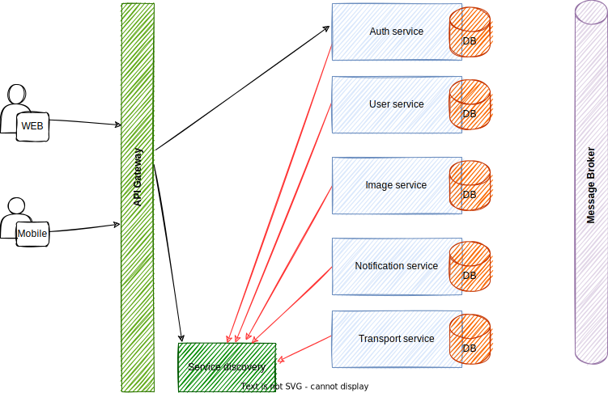

# epal

## Introduction

Public repository for epal project

## Technology Stack

1. Java 11
2. Spring boot (DATA JPA , SECURITY , CLOUD)
3. JUnit 5 & AssertJ & TestContainers
4. Slf4j & Lombok & Mapstruct
5. Apache (Commons,HttpCore, HttpClient)
6. MySQL , REDIS , MONGODB
7. Maven
8. Docker

## Architecture



## SETUP

<br>1. Install docker & docker compose locally

## TO RUN

```
docker compose up -d
```